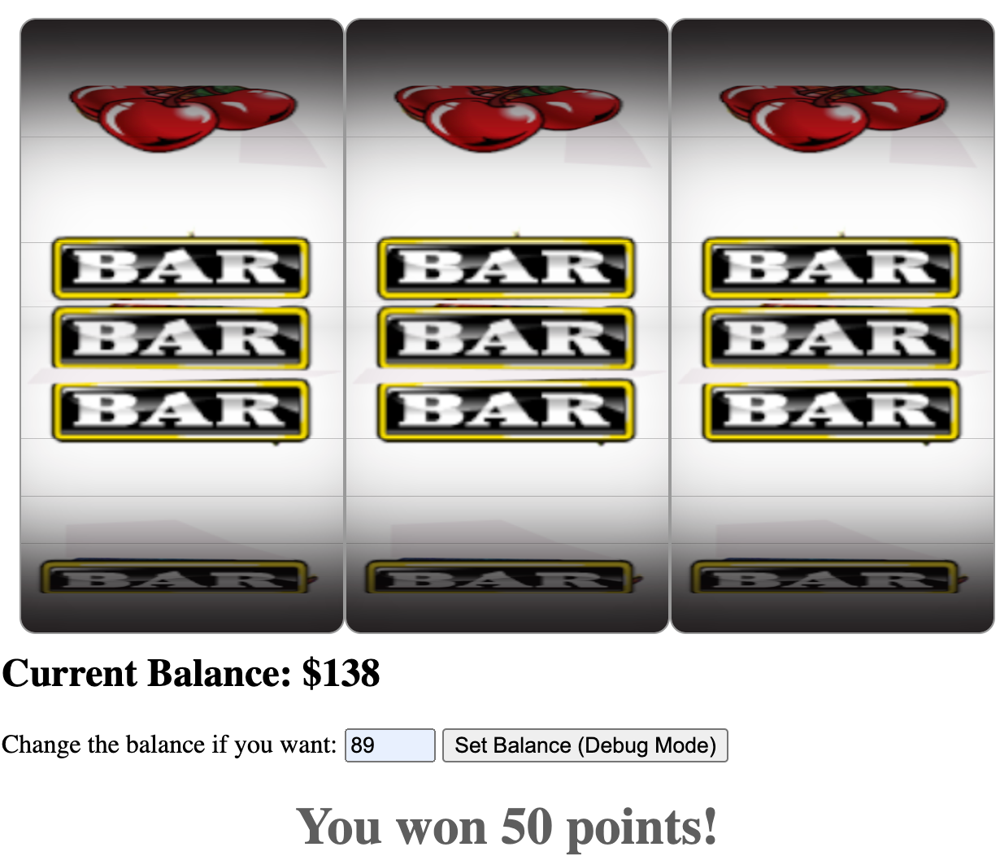

<!-- PROJECT LOGO -->
 

  
   
  

    A Slot Machine project for a coding challenge!
       
    <a href="https://nifty-engelbart-7a61f7.netlify.app/">View a Demo of the Slot Machine in Action!</a>
  

<!-- ABOUT THE PROJECT -->
# About The Project

This coding challenge asked for best practices and scaleable solutions instead of "hacky" fixes.  Here is a [live version](https://nifty-engelbart-7a61f7.netlify.app/) of the application.  

I did not have the time to create the optimal solution nor do I think being a strict programmer is my greatest skillset.  I am better suited for roles where I can work with clients to identify their needs and problems and then code the solutions to solve them.  If you need a programmer with people skills I am happy to discuss more.    

Here's what I DID NOT do in this project per your requirements:
* Logic to handle winnings in the top and bottom line positions; I only handled the center. 
* A red line marking the center
* Implimenting nont hacky solutions :smile:

### Libraries used

I refactored the Slotmachine Interface library to fit the needs of the project but it provided the original animation reels.  Lodash is a helpful library to assist in querying arrays and objects.    
* [Slotmacbine Interface](https://github.com/nuxy/slot-machine-gen)
* [lodash](https://lodash.com/)

## Overview

I wanted to build this project in React since that's the FE framework I've worked with the most.  For the sake of time I did it in vanilla JS with the bare minimum libraries listed above.  If you would like to see further examples of my work with React or more detailed FE projects, see the links below:

* [Encrypted File Storage System](http://seanstech.life/encrypted-folder-file-storage-tool/#)
* [Full Stack Initiavie](http://seanstech.life/company-full-stack-initiative/#)
* [Cocktail Coding Challenge](https://github.com/sastrakhan/cocktail-recipes)
* [Bus Transportation Dashboard](https://github.com/sastrakhan/Bus-Service-Dashboard-React-Redux)

<!-- CONTACT -->
### Contact

Email - sastrakhan@gmail.com

